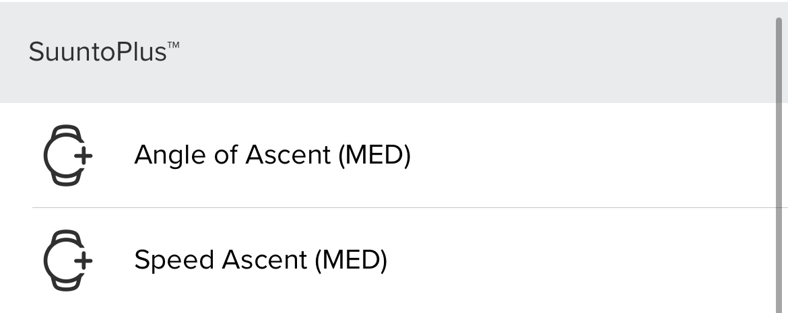
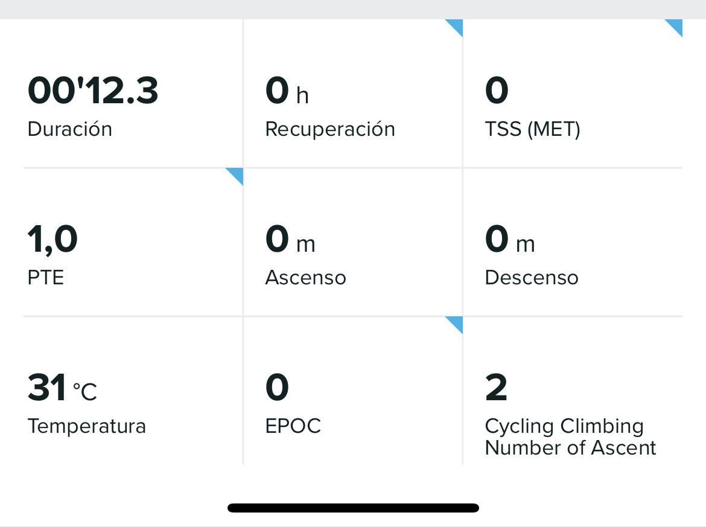

# Cycling Climbing
Suunto App Cycling Climbing

This application is designed to show the meters climbed on each ascent/descent. It shows the Speed on the Ascent, the meters Climbed and the number of Attempts plus the Angle of Ascent. Stores in the SA the number of times we completed ascent/descent in a training session. Stores in the SA Suunto Plus the speed in Ascent and for each Ascent/Descents plus the Ascent Angle. Generates a lap every time you finish the route or ascent/descent (you can also force that you have finished the ascent/descent or route by pressing the lap button).***

### Screen Design:
    

 
 
### SA Outputs:
  #### Suunto Plus Metrics to analize later in SA
  
    
   
  #### SA Summary Outputs
  
    
   
## To be improve:
  - More precision in climbAngleAscent, because it uses the distance without GSP.

## I will Try to do it if possible:
  - 15 different grading scales : https://www.guidedolomiti.com/en/rock-climbing-grades/

---
### :fire: My Stats :

